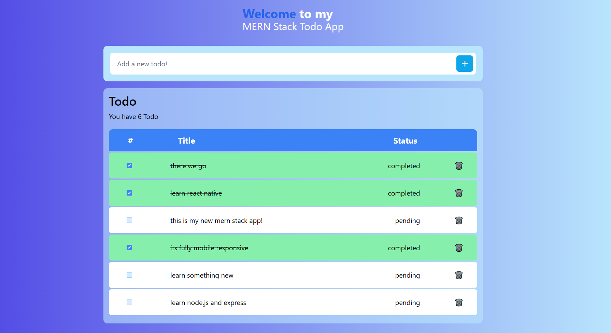
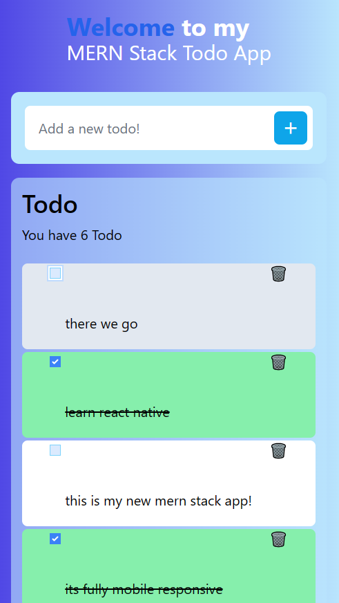

# MERN Todo App 

This is the backend for MERN-Stack Todo app with Node.js and Express.js

## Learning Objectives

 - Node.js and Express.js
 - Mongodb database
 - CRUD operation 

## App Preview Frontend

